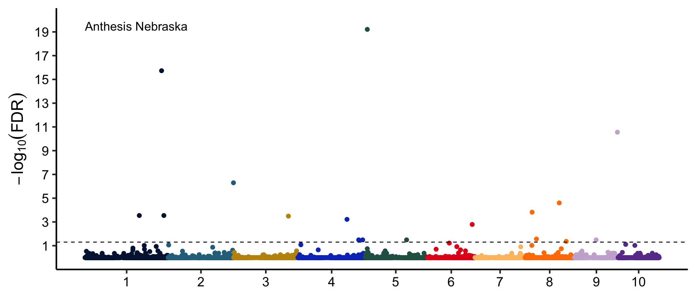

# Tutorial for Transcriptome-Wide Association Study (TWAS)

- [Part 1: Obtaining Gene Expression Levels from RNA-Seq Data](#part-1-obtaining-gene-expression-levels-from-rna-seq-data)
- [Part 2: Transcriptome-Wide Association Study (TWAS)](#part-2-transcriptome-wide-association-study-twas)

## Part 1: Obtaining Gene Expression Levels from RNA-Seq Data

This tutorial guides you through obtaining gene expression data to perform TWAS. It is based on data used in the paper [Torres‐Rodríguez, J. Vladimir, et al., 2024, "Population‐level gene expression can repeatedly link genes to functions in maize"](https://onlinelibrary.wiley.com/doi/full/10.1111/tpj.16801).

---

## Prerequisites
The tutorial assumes familiarity with **Bash**, **Python**, and **R**. You will need access to `fastqc`, `multiqc`, `trimmomatic`, and `kallisto`.  
Large datasets, including trimmed FASTA files and the `.idx` file for Kallisto, are available on Figshare: [Figshare Link](https://figshare.com/articles/dataset/TWAS_tutorial/27312822).

---
## Step 1: Setup
Go to your work directory and create the respective folders to work on

```bash
cd $WORK
mkdir TWASTutorial
mkdir TWASTutorial/scripts
mkdir TWASTutorial/output
mkdir TWASTutorial/input
mkdir TWASTutorial/log.out
cd TWASTutorial
```

## Step 2: Download data
We are downloading raw data from the [European Nucleotide Archive (ENA)](https://www.ebi.ac.uk/ena/browser/home) under the study accession number: PRJEB67964. This data includes RNA-Seq from 750 maize individuals (1,500 files) collected from leaves at the mature stage in Nebraska in 2020. _But for teaching purposes, we are downloading only 12 samples belonging to six individuals_

Download the script "downloadSamples.sh", move it to folder 'scripts' and run it. The code provided will run in the Background

```bash
#Run this command to give the script executable permissions:
chmod +x downloadFiveSamples.sh

#Execute the Script
./downloadSamples.shs.sh > download_log.txt 2>&1

#check if the files exist
ls ../fasta
ls ../fasta -lh # -lh displays more information
ls ../fasta | wc -l # displays the number of files, for this example should be 12 belonging to six individuals (for example 2369_1.fastq.gz & 2369_2.fastq.gz)

#if you want to open the fasta file you can use:
#for more information check: https://en.wikipedia.org/wiki/FASTQ_format
zcat ../fasta/2369_1.fastq.gz | head

```
## Step 3: Check the quality of the data
We can use [FastQC](https://www.bioinformatics.babraham.ac.uk/projects/fastqc/) and [MultiQC](https://github.com/MultiQC/MultiQC)

First, run an example for "2369_1.fastq.gz". Please measure the time with a stopwatch (around 3 minutes per sample).
```bash
ml fastqc/0.12 #if the module is not loaded
fastqc ../fasta/2369_1.fastq.gz -o ../fasta/fastqc_reports
```
If we are running a few samples we can adjust the code to run like this (see below), but the time can increase massively (i.e for 12 samples = 36 min but what if we use the 1,500 samples)
```bash
fastqc ../fasta/*.fastq.gz -o ../fasta/fastqc_reports
```
We will run jobs using slurm files and the array option:

```bash
nano fastqc.slurm # to create a new slurm file
#copy the following code inside

#!/bin/sh
#SBATCH --array=1-12
#SBATCH --job-name=fastqc
#SBATCH --time=3-00:00:00
#SBATCH --mem-per-cpu=10GB
#SBATCH --output=../log.out/%x_%a.out
#SBATCH --partition=schnablelab,batch
#SBATCH --mail-type=ALL

# Load FastQC module
ml fastqc/0.12

# Define the list of samples and get the current sample
SAMPLE_FILE="samples.txt"
SAMPLE=$(sed -n "${SLURM_ARRAY_TASK_ID}p" $SAMPLE_FILE)
echo ${SAMPLE}

# Run FastQC on the selected sample
fastqc ${SAMPLE} -o ../fasta/fastqc_reports
```
Then we can use MultiQC to aggregate all the reports

```bash
ml multiqc/py37/1.8 #if the module is not loaded
multiqc ../fasta/fastqc_reports -o ../fasta/multiqc_report
```
you can submit the job with:

```bash
sbatch fastqc.slurm # to run the file
```

## Step 4: Remove adapters and low-quality bases
This step uses [Trimmomatic](http://www.usadellab.org/cms/?page=trimmomatic)

The order is important! Trimming occurs in the order in which the steps are specified on the command line. It is recommended that adapter clipping (ILLUMINACLIP) is done as early as possible.

Since we know now how to parallelize, let's use arrays (This step will take ~20-25 min per sample (I suggest to download the samples provided in the folder "fasta.trimmed" from the figshare repository [see above] to save some time but you are welcome to run this anytime))

We can find multiple [adapter](https://github.com/usadellab/Trimmomatic/tree/main/adapters) libraries in the Trimmomatic GitHub page.

Create a file with the location of the fastq files:
```bash
#to create a file with the name of the individuals (six in this example))
find ../fasta -name "*_1.fastq.gz" | sed 's/_1.fastq.gz//g' > files.path.txt
```


```bash
# first create this folder:
mkdir ../fasta.trimmed

nano trimmomatic.slurm
#copy pase the following code in side

#!/bin/sh
#SBATCH --array=1-6
#SBATCH --job-name=trimm
#SBATCH --time=1-00:00:00
#SBATCH --mem-per-cpu=10GB
#SBATCH --output=../log.out/%x_%a.out
#SBATCH --partition=schnablelab,batch
#SBATCH --mail-type=ALL

ml trimmomatic/0.33
ml java/12

samplesheet="files.path.txt"
f=`sed -n "$SLURM_ARRAY_TASK_ID"p $samplesheet |  awk '{print $1}'`
o=`echo ${f} | cut -d'/' -f3-`

mkdir ../fasta.trimmed/${o}

java -jar $TM_HOME/trimmomatic.jar PE -phred33 ${f}_1.fastq.gz ${f}_2.fastq.gz ../fasta.trimmed/${o}/${o}_1_paired.fastq.gz ../fasta.trimmed/${o}/${o}_1_unpaired.fastq.gz output/${o}/${o}_2_paired.fastq.gz ../fasta.trimmed/${o}/${o}_2_unpaired.fastq.gz ILLUMINACLIP:../TruSeq3-PE.fa:2:30:10 LEADING:3 TRAILING:3 SLIDINGWINDOW:4:15 MINLEN:35

```
you can submit the job with:

```bash
sbatch trimmomatic.slurm
```

## Step 5: Check quality after removing adapters and low-quality bases

We will run jobs using slurm files and the array option:

```bash
mkdir ../fasta.trimmed/fastqc_reports
nano fastqc2.slurm # to create a new slurm file

#the file will include

#!/bin/sh
#SBATCH --array=1-12
#SBATCH --job-name=fastqc2
#SBATCH --time=3-00:00:00
#SBATCH --mem-per-cpu=10GB
#SBATCH --output=../log.out/%x_%a.out
#SBATCH --partition=schnablelab,batch
#SBATCH --mail-type=ALL

# Load FastQC module
ml fastqc

# find ../fasta.trimmed -name "*_paired.fastq.gz" > samples.trimmed.txt

# Define the list of samples and get the current sample
SAMPLE_FILE="samples.trimmed.txt"
SAMPLE=$(sed -n "${SLURM_ARRAY_TASK_ID}p" $SAMPLE_FILE)
echo ${SAMPLE}

# Run FastQC on the selected sample
fastqc ${SAMPLE} -o ../fasta.trimmed/fastqc_reports
```
you can submit the job with:

```bash
sbatch fastqc2.slurm
```

Then we can use MultiQC to aggregate all the reports

```bash
ml multiqc #if the module is not loaded
multiqc ../fasta.trimmed/fastqc_reports -o ../fasta.trimmed/multiqc_report
```

## Step 6: Quantify gene expression
This step will use [Kallisto](https://pachterlab.github.io/kallisto/manual). 

Kallisto’s pseudo-alignment approach makes it exceptionally fast and memory-efficient, suitable for analyzing large RNA-Seq datasets. It’s widely used in gene expression studies due to its accuracy and speed, though it may lack the detailed read-level information that traditional aligners provide.

First, we need to create an index of the transcript. Download the file "Zmays_833_Zm-B73-REFERENCE-NAM-5.0.55.transcript_primaryTranscriptOnly.fa" and load it to your working directory. In the folder where you placed this file run: (In this example I am putting it in the folder "input")

```bash
ml kallisto/0.46
kallisto index -i Zm-B73-REFERENCE-NAM-5.0.55.transcript_primaryTranscriptOnly.idx Zmays_833_Zm-B73-REFERENCE-NAM-5.0.55.transcript_primaryTranscriptOnly.fa.gz
```

We then can map all the reads from "*paired.gz" files.

```bash
# Ensure the output directory exists:
mkdir ../input/out.kallisto

nano kallisto.slurm
#copy paste the following code

#!/bin/sh
#SBATCH --array=1-6
#SBATCH --job-name=quant
#SBATCH --time=1-00:00:00
#SBATCH --mem-per-cpu=10GB
#SBATCH --output=../log.out/%x_%a.out
#SBATCH --partition=schnablelab,batch
#SBATCH --mail-type=ALL

ml load kallisto/0.46

samplesheet="files.path.txt"
f=`sed -n "$SLURM_ARRAY_TASK_ID"p $samplesheet |  awk '{print $1}'`
o=`echo ${f} | cut -d'/' -f3-`

kallisto quant --threads=10 -i ../input/Zm-B73-REFERENCE-NAM-5.0.55.transcript_primaryTranscriptOnly.idx -o ../input/out.kallisto/${o} ../fasta.trimmed/${o}/${o}_1_paired.fastq.gz ../fasta.trimmed/${o}/${o}_2_paired.fastq.gz
```

This will create a folder for each individual with the following files:

1. **abundance.tsv**: This is the primary output file, which contains transcript-level expression estimates. It includes the following columns:
   - `target_id`: The transcript ID (usually matching the transcript IDs in the reference transcriptome).
   - `length`: The length of each transcript.
   - `eff_length`: The effective length of the transcript, adjusted for read length.
   - `est_counts`: The estimated number of reads assigned to each transcript.
   - `tpm`: Transcripts per million, a normalized measure of expression.

2. **abundance.h5**: A binary file containing all abundance information in HDF5 format. This file is used by downstream tools, such as Sleuth, to perform differential expression analysis and provides more efficient data storage and access than a plain text file.

3. **run_info.json**: A JSON file containing metadata about the run, including the Kallisto version, the command used, the number of processed reads, and the total runtime. This file is useful for tracking parameters and ensuring reproducibility.


## Step 7: gene expression table

Create a new python file:
```bash
nano make_rna_ss.py
```
paste inside the code:

```python
import os
import sys

mydir = sys.argv[1]
if not os.path.exists(mydir):
    sys.exit("{0} is not a valid directory".format(mydir))

gene_exp_dict = {}
sample_list = []
mysamples = os.listdir(mydir)
for asample in mysamples:
    if not os.path.isdir(mydir + "/" + asample): continue
    if not os.path.exists(mydir + "/" + asample + "/" + "abundance.tsv"): continue
    fh = open(mydir + "/" + asample + "/" + "abundance.tsv")
    sample_list.append(asample)
    fh.readline()
    for x in fh:
        y = x.strip().split('\t')
        mygene = y[0]
        mytpm = float(y[-1])
        if not mygene in gene_exp_dict: gene_exp_dict[mygene] = {}
        gene_exp_dict[mygene][asample] = mytpm
    fh.close()
#print(sample_list)
#print(gene_exp_dict[list(gene_exp_dict)[0]])
fh = open("merged_gene_tpms.csv",'w') #change with the desire name for output
myheader = ["GeneID"] + sorted(sample_list)
fh.write(",".join(myheader)+"\n")
for agene in sorted(list(gene_exp_dict)):
    plist = [agene]
    for asample in sorted(sample_list):
        plist.append(gene_exp_dict[agene][asample])
    fh.write(",".join(map(str,plist))+"\n")
```

Run it:

```bash
python3 make_rna_ss.py ../input/out.kallisto
```
The final output is the file named "merged_gene_tpms.csv". This example was with just six individuals, the complete gene expression dataset is located in the [Figshare link](https://figshare.com/articles/dataset/merged_gene_tpms_longestT_csv_zip/24470758?file=42997288)


## Part 2: Transcriptome-Wide Association Study (TWAS)

## Step 1: Pre-process data
To save some time we will provide information on the files needed to run TWAS and how data was filtered, but the code is not provided, rather the files can be downloaded from the folder "InputFiles.zip" in the [Figshare repository](https://figshare.com/articles/dataset/TWAS_tutorial/27312822)

We need at least three files to run TWAS on [GAPIT](https://zzlab.net/GAPIT/):
   - `Filtered_gene_expression`: A file where columns are genotypes and rows are gene expression levels
   - `Gene_information`: The information for each gene to be analyzed. The information is Gene ID, chromosome, and start position are included here
   - `Phenotype`: A file with the values of the desired trait to analyze.
     
   - `Covariates`: Optional. This file contains data that can be relevant to the analysis 

Filtered gene expression was generated by filtering based on the criteria below which resulted in the gene expression dataset "counts.NE2020.693.filtered.txt"
 
Two different criteria were used in the original paper:
1. **PCA distribution**: If a sample was an outlier based on a PCA conducted with gene expression, the sample was removed.
2. **Low expressed genes**: If a gene was expressed lower than 0.1 TPM in less than 50% of the samples, the gene was removed.


## Step 2: Run TWAS
Please download the data to your working directory (see "Step 1: Pre-process data" to find data).

If you want more information on the program please use the following link: [GAPIT](https://zzlab.net/GAPIT/)

TWAS is fast and can be run on a local computer or in the cluster. The code provided here was run in a local computer
```R
setwd("/Users/vladimir/TWAS_tutorial")

source("http://zzlab.net/GAPIT/gapit_functions.txt") #install GAPIT

#install.packages("data.table") # if not installed please install.
library("data.table") # load library


#load the phenotype data
phe <- read.table("pheno_693.txt", head = TRUE)
trait=which(colnames(phe) == "Anthesis.sp.NE") # Our data has several columns, we are selecting one based on column name
colnames(phe[trait])

myY <- phe[,c(1,trait)]

#covariates
myCV <- read.csv("sampling_693.order.csv", head = TRUE)
colnames(myCV)

#load counts data
counts <- fread("counts.NE2020.693.filtered.txt", data.table = F)
row.names(counts) <- counts$taxa

## check the number of lines matching
NROW(merge(counts[,1], phe, by = 1))


#use quantile method to handle outliers and transform data to 0-2
Quantile<- apply(counts[,-1],2,  # 2 indicates it is for column and 1 indicates it is for row
                 function(A){min_x=as.numeric(quantile(A,0.05));
                 max_x=as.numeric(quantile(A,0.95));
                 out<-(2*(A-min_x)/(max_x-min_x));
                 out[out>2]<-2;out[out< 0]<- 0;return(out)})


Quantile.t <- as.data.frame(Quantile)
Quantile.t$taxa <- row.names(Quantile.t)
myGD <-  Quantile.t[,c(ncol(Quantile.t),1: (ncol(Quantile.t)-1))]


myGM <- read.table("gene_info_693.txt", head = TRUE)
unique(myGM$chr) #only cromosomes 

myGAPIT <- GAPIT(Y=myY,
                 GD=myGD,
                 GM=myGM,
                 CV=myCV,
                 PCA.total=3,
                 model= "CMLM",
                 SNP.MAF=0,
                 file.output=F
)
#warnings()

#getting the important genes and Manhattan plots
values <- data.frame(myGAPIT$GWAS)
values$FDR <- p.adjust(values$P.value,method = "BH")

write.csv(values, paste0("TWAS.CMLM_",colnames(phe[trait]),".csv"), row.names = F)
```

## Step 3: Make the Manhattan plot and extract the genes with significant association

```R
setwd("/Users/vladimir/TWAS_tutorial")

library(dplyr)
library(ggplot2)
library(ggrastr)

#set parameters to the plot
theme_set(theme_classic(base_size = 19))
theme_update(axis.text.x = element_text(colour = "black"), axis.text.y = element_text(colour = "black"),
             plot.title = element_text(hjust = 0.5), plot.subtitle=element_text(hjust=0.5))


trait <- "Anthesis.sp.NE"
gwas.datTWAS <- fread(paste0("TWAS.CMLM_",trait,".csv"), data.table = F)

#creating variables that will help with the plot
nCHR <- length(unique(gwas.datTWAS$Chromosome))
gwas.datTWAS$BPcum <- NA
s <- 0
nbp <- c()

for (i in sort(unique(gwas.datTWAS$Chromosome))){
  nbp[i] <- max(gwas.datTWAS[gwas.datTWAS$Chromosome == i,]$`Position.`)
  gwas.datTWAS[gwas.datTWAS$Chromosome == i,"BPcum"] <- gwas.datTWAS[gwas.datTWAS$Chromosome == i,"Position."] + s
  s <- s + nbp[i]
}

axis.set <- gwas.datTWAS %>% 
  group_by(Chromosome) %>% 
  summarize(center = (max(BPcum) + min(BPcum)) / 2, maxBP=max(BPcum))

#IDs for genes with FDR less than 0.05
fdr.treshold <- -log10(0.05)

gTWAS.anthesis.NE <- ggplot(data=gwas.datTWAS, aes(BPcum, -log10(FDR), colour=factor(Chromosome, levels = c(1:10)))) + 
  #rasterise(geom_point(size = 2),dpi=600) + 
  geom_point(size = 2) + 
  geom_hline(yintercept = -log10(0.05), linetype=2) + 
  scale_color_manual(values = c('#03193F','#28708C','#BF930F','#0f3bbf','#295E52','#e31a1c','#fdbf6f','#ff7f00','#cab2d6','#6a3d9a')) + 
  annotate("text", label="Anthesis Nebraska", y=19.5, x=100, size=5,hjust="inward") +
  scale_x_continuous(label = axis.set$Chromosome, breaks = axis.set$center) + 
  theme(legend.position = "none", axis.title.x=element_blank()) + 
  ylab(expression(-log[10](FDR))) + 
  xlab("Chromosome") +
  scale_y_continuous(limits = c(0, 20),
                     breaks = seq(1, 20, 2))
#+ labs(title="", subtitle=paste0(trait))

gTWAS.anthesis.NE

##############

#To extract genes ID associated

associatedGenes <- gwas.datTWAS[which(gwas.datTWAS$FDR < 0.05),]
fwrite(associatedGenes, "associatedGenes.csv")
```



## Step 4: Look for information of associated genes
Once we generate the file we can open it and see which is the gene ID. We are using as an example "Zm00001eb057540".

Depending on the specie you are working you can look at multiple pages, for maize we have [MaizeGDB](https://www.maizegdb.org), [Phytozome](https://phytozome-next.jgi.doe.gov) or simply google the gene ID on Google Scholar. Remember that in maize a single gene can have multiple IDs (one for each version)


