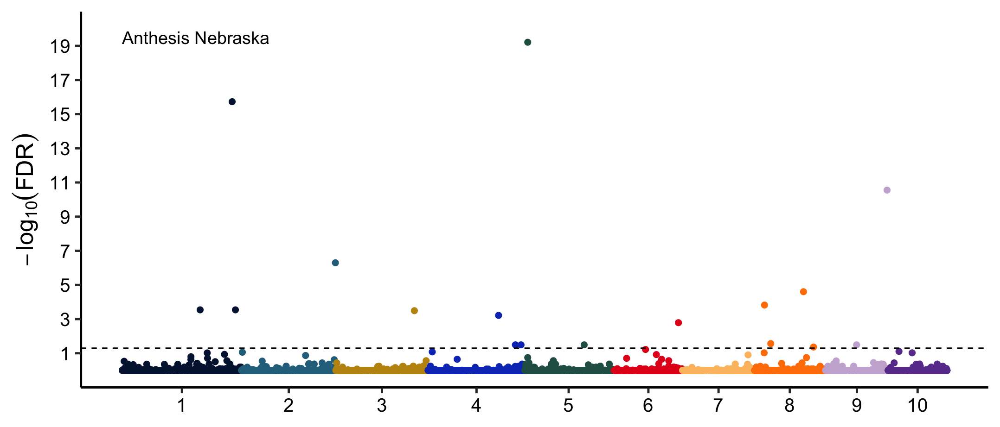

<h1 align="center">Transcriptome-Wide Association Study (TWAS) Tutorial</h1>
<p align="center"><strong>RNA-seq processing to TWAS in maize</strong></p>

<p align="center">
  
  
  
</p>

This repository contains a teaching-oriented TWAS workflow in maize. This version focuses on clarity and reproducibility while preserving the original analysis approach.

## Quick Navigation

| Section | Focus | Main outputs |
| --- | --- | --- |
| [Part 1](#part-1-obtain-gene-expression-levels-from-rna-seq) | RNA-seq QC, trimming, and quantification | `abundance.tsv`, `merged_gene_tpms.csv` |
| [Part 2](#part-2-run-twas-with-gapit) | Association testing and visualization | `TWAS.CMLM_*.csv`, `associatedGenes.csv` |

## Reference
This tutorial is based on data used in:
[Torres-Rodriguez, J. Vladimir, et al. (2024), "Population-level gene expression can repeatedly link genes to functions in maize"](https://onlinelibrary.wiley.com/doi/full/10.1111/tpj.16801)

For missing files or questions, contact `vladimir.torres@unl.edu`.

## Prerequisites
- Familiarity with Bash, Python, and R.
- Access to `fastqc`, `multiqc`, `trimmomatic`, and `kallisto`.
- Optional HPC/Slurm environment for parallel runs.
- Large supporting datasets on Figshare:
  [TWAS_tutorial](https://figshare.com/articles/dataset/TWAS_tutorial/27312822)

---

## Part 1: Obtain gene expression levels from RNA-seq

### Step 1: Setup working folders
Use a consistent project directory name to avoid path confusion:

```bash
export TWAS_WORK="$HOME/TWAS_tutorial"
mkdir -p "$TWAS_WORK"/{scripts,input,output,log.out,fasta,fasta.trimmed}
cd "$TWAS_WORK/scripts"
```

Copy helper files from this repository into `scripts/`:

```bash
cp /path/to/TWAStutorial/downloadSamples.sh .
cp /path/to/TWAStutorial/samples.txt .
```

### Step 2: Download example FASTQ files (12 files, 6 individuals)
Data source: ENA study `PRJEB67964`.

```bash
chmod +x downloadSamples.sh
./downloadSamples.sh > download_log.txt 2>&1

# Verify download
ls ../fasta -lh
ls ../fasta/*.fastq.gz | wc -l

# Peek into one file
zcat ../fasta/2369_1.fastq.gz | head
```

### Step 3: Quality control with FastQC and MultiQC
Create report folders:

```bash
mkdir -p ../fasta/fastqc_reports ../fasta/multiqc_report
```

Run a single file first:

```bash
ml fastqc/0.12   # or module load fastqc/0.12
fastqc ../fasta/2369_1.fastq.gz -o ../fasta/fastqc_reports
```

Run all 12 files:

```bash
fastqc ../fasta/*.fastq.gz -o ../fasta/fastqc_reports
```

Optional Slurm array example (`fastqc.slurm`):

```bash
#!/bin/sh
#SBATCH --array=1-12
#SBATCH --job-name=fastqc
#SBATCH --time=3-00:00:00
#SBATCH --mem-per-cpu=10GB
#SBATCH --output=../log.out/%x_%a.out
#SBATCH --partition=schnablelab,batch
#SBATCH --mail-type=ALL

ml fastqc/0.12

SAMPLE_FILE="samples.txt"
SAMPLE=$(sed -n "${SLURM_ARRAY_TASK_ID}p" "${SAMPLE_FILE}")
echo "${SAMPLE}"

fastqc "${SAMPLE}" -o ../fasta/fastqc_reports
```

Submit:

```bash
sbatch fastqc.slurm
```

Aggregate reports:

```bash
ml multiqc/py37/1.8   # or module load multiqc
multiqc ../fasta/fastqc_reports -o ../fasta/multiqc_report
```

### Step 4: Remove adapters and low-quality bases (Trimmomatic)
Trimmomatic adapter files are available here:
[Trimmomatic adapters](https://github.com/usadellab/Trimmomatic/tree/main/adapters)

Create file prefixes for paired-end files:

```bash
find ../fasta -name "*_1.fastq.gz" | sed 's/_1.fastq.gz$//g' > files.path.txt
mkdir -p ../fasta.trimmed
```

Create `trimmomatic.slurm`:

```bash
#!/bin/sh
#SBATCH --array=1-6
#SBATCH --job-name=trimm
#SBATCH --time=1-00:00:00
#SBATCH --mem-per-cpu=10GB
#SBATCH --output=../log.out/%x_%a.out
#SBATCH --partition=schnablelab,batch
#SBATCH --mail-type=ALL

ml trimmomatic/0.33
ml java/12

samplesheet="files.path.txt"
f=$(sed -n "${SLURM_ARRAY_TASK_ID}p" "${samplesheet}" | awk '{print $1}')
o=$(echo "${f}" | cut -d'/' -f3-)

mkdir -p ../fasta.trimmed/"${o}"

java -jar "${TM_HOME}/trimmomatic.jar" PE -phred33 \
  "${f}_1.fastq.gz" "${f}_2.fastq.gz" \
  ../fasta.trimmed/"${o}"/"${o}"_1_paired.fastq.gz \
  ../fasta.trimmed/"${o}"/"${o}"_1_unpaired.fastq.gz \
  ../fasta.trimmed/"${o}"/"${o}"_2_paired.fastq.gz \
  ../fasta.trimmed/"${o}"/"${o}"_2_unpaired.fastq.gz \
  ILLUMINACLIP:../TruSeq3-PE.fa:2:30:10 \
  LEADING:3 TRAILING:3 SLIDINGWINDOW:4:15 MINLEN:35
```

Submit:

```bash
sbatch trimmomatic.slurm
```

### Step 5: QC after trimming

```bash
mkdir -p ../fasta.trimmed/fastqc_reports ../fasta.trimmed/multiqc_report
find ../fasta.trimmed -name "*_paired.fastq.gz" > samples.trimmed.txt
```

Create `fastqc2.slurm`:

```bash
#!/bin/sh
#SBATCH --array=1-12
#SBATCH --job-name=fastqc2
#SBATCH --time=3-00:00:00
#SBATCH --mem-per-cpu=10GB
#SBATCH --output=../log.out/%x_%a.out
#SBATCH --partition=schnablelab,batch
#SBATCH --mail-type=ALL

ml fastqc/0.12

SAMPLE_FILE="samples.trimmed.txt"
SAMPLE=$(sed -n "${SLURM_ARRAY_TASK_ID}p" "${SAMPLE_FILE}")
echo "${SAMPLE}"

fastqc "${SAMPLE}" -o ../fasta.trimmed/fastqc_reports
```

Submit and aggregate:

```bash
sbatch fastqc2.slurm
ml multiqc
multiqc ../fasta.trimmed/fastqc_reports -o ../fasta.trimmed/multiqc_report
```

### Step 6: Quantify expression with Kallisto
Kallisto manual:
[https://pachterlab.github.io/kallisto/manual](https://pachterlab.github.io/kallisto/manual)

Download transcript FASTA:
`Zmays_833_Zm-B73-REFERENCE-NAM-5.0.55.transcript_primaryTranscriptOnly.fa.gz`

Build index (example in `input/`):

```bash
cd ../input
ml kallisto/0.46
kallisto index \
  -i Zm-B73-REFERENCE-NAM-5.0.55.transcript_primaryTranscriptOnly.idx \
  Zmays_833_Zm-B73-REFERENCE-NAM-5.0.55.transcript_primaryTranscriptOnly.fa.gz
```

Back in `scripts/`, create `kallisto.slurm`:

```bash
#!/bin/sh
#SBATCH --array=1-6
#SBATCH --job-name=quant
#SBATCH --time=1-00:00:00
#SBATCH --mem-per-cpu=10GB
#SBATCH --output=../log.out/%x_%a.out
#SBATCH --partition=schnablelab,batch
#SBATCH --mail-type=ALL

ml kallisto/0.46

samplesheet="files.path.txt"
f=$(sed -n "${SLURM_ARRAY_TASK_ID}p" "${samplesheet}" | awk '{print $1}')
o=$(echo "${f}" | cut -d'/' -f3-)

mkdir -p ../input/out.kallisto/"${o}"
kallisto quant --threads=10 \
  -i ../input/Zm-B73-REFERENCE-NAM-5.0.55.transcript_primaryTranscriptOnly.idx \
  -o ../input/out.kallisto/"${o}" \
  ../fasta.trimmed/"${o}"/"${o}"_1_paired.fastq.gz \
  ../fasta.trimmed/"${o}"/"${o}"_2_paired.fastq.gz
```

Submit:

```bash
sbatch kallisto.slurm
```

Each sample folder in `../input/out.kallisto/` contains:
1. `abundance.tsv` (transcript-level estimates, including TPM)
2. `abundance.h5` (binary format for downstream tools)
3. `run_info.json` (run metadata)

### Step 7: Build a merged TPM matrix
Create `make_rna_ss.py`:

```python
import os
import sys

mydir = sys.argv[1]
if not os.path.exists(mydir):
    sys.exit(f"{mydir} is not a valid directory")

gene_exp_dict = {}
sample_list = []

for asample in os.listdir(mydir):
    sample_dir = os.path.join(mydir, asample)
    abundance = os.path.join(sample_dir, "abundance.tsv")
    if not os.path.isdir(sample_dir):
        continue
    if not os.path.exists(abundance):
        continue

    sample_list.append(asample)
    with open(abundance) as fh:
        fh.readline()
        for x in fh:
            y = x.strip().split("\t")
            mygene = y[0]
            mytpm = float(y[-1])
            if mygene not in gene_exp_dict:
                gene_exp_dict[mygene] = {}
            gene_exp_dict[mygene][asample] = mytpm

with open("merged_gene_tpms.csv", "w") as fh:
    myheader = ["GeneID"] + sorted(sample_list)
    fh.write(",".join(myheader) + "\n")
    for agene in sorted(gene_exp_dict):
        plist = [agene]
        for asample in sorted(sample_list):
            plist.append(gene_exp_dict[agene][asample])
        fh.write(",".join(map(str, plist)) + "\n")
```

Run:

```bash
python3 make_rna_ss.py ../input/out.kallisto
```

Output: `merged_gene_tpms.csv`

Full expression matrix on Figshare:
[merged_gene_tpms_longestT_csv_zip](https://figshare.com/articles/dataset/merged_gene_tpms_longestT_csv_zip/24470758?file=42997288)

---

## Part 2: Run TWAS with GAPIT

### Step 1: Pre-process data
To save time, pre-processed files are provided in `InputFiles.zip` on Figshare:
[TWAS_tutorial](https://figshare.com/articles/dataset/TWAS_tutorial/27312822)

Required files:
- `Filtered_gene_expression`: rows are taxa, columns are genes.
- `Gene_information`: gene ID, chromosome, and position.
- `Phenotype`: trait values.
- `Covariates` (optional): additional model covariates.

Filtering criteria used in the original paper:
1. Remove outlier samples based on PCA from gene expression.
2. Remove genes with TPM < 0.1 in at least 50% of samples.

### Step 2: Run TWAS

```r
setwd("/Users/vladimir/TWAS_tutorial")

source("https://zzlab.net/GAPIT/gapit_functions.txt")

# install.packages("data.table")
library(data.table)

# load phenotype data
phe <- read.table("pheno_693.txt", head = TRUE)
trait <- which(colnames(phe) == "Anthesis.sp.NE")
myY <- phe[, c(1, trait)]

# covariates
myCV <- read.csv("sampling_693.order.csv", head = TRUE)

# load filtered expression
counts <- fread("counts.NE2020.693.filtered.txt", data.table = FALSE)
row.names(counts) <- counts$taxa

# check matching taxa
NROW(merge(counts[, 1], phe, by = 1))

# quantile transform to 0-2
Quantile <- apply(
  counts[, -1], 2,
  function(A) {
    min_x <- as.numeric(quantile(A, 0.05))
    max_x <- as.numeric(quantile(A, 0.95))
    out <- (2 * (A - min_x) / (max_x - min_x))
    out[out > 2] <- 2
    out[out < 0] <- 0
    out
  }
)

Quantile.t <- as.data.frame(Quantile)
Quantile.t$taxa <- row.names(Quantile.t)
myGD <- Quantile.t[, c(ncol(Quantile.t), 1:(ncol(Quantile.t) - 1))]

myGM <- read.table("gene_info_693.txt", head = TRUE)
unique(myGM$chr)

myGAPIT <- GAPIT(
  Y = myY,
  GD = myGD,
  GM = myGM,
  CV = myCV,
  PCA.total = 3,
  model = "CMLM",
  SNP.MAF = 0,
  file.output = FALSE
)

values <- data.frame(myGAPIT$GWAS)
values$FDR <- p.adjust(values$P.value, method = "BH")
write.csv(values, paste0("TWAS.CMLM_", colnames(phe[trait]), ".csv"), row.names = FALSE)
```

### Step 3: Manhattan plot and significant genes

```r
setwd("/Users/vladimir/TWAS_tutorial")

library(data.table)
library(dplyr)
library(ggplot2)
library(ggrastr)

theme_set(theme_classic(base_size = 19))
theme_update(
  axis.text.x = element_text(colour = "black"),
  axis.text.y = element_text(colour = "black"),
  plot.title = element_text(hjust = 0.5),
  plot.subtitle = element_text(hjust = 0.5)
)

trait <- "Anthesis.sp.NE"
gwas.datTWAS <- fread(paste0("TWAS.CMLM_", trait, ".csv"), data.table = FALSE)

gwas.datTWAS$BPcum <- NA
s <- 0
nbp <- c()
for (i in sort(unique(gwas.datTWAS$Chromosome))) {
  nbp[i] <- max(gwas.datTWAS[gwas.datTWAS$Chromosome == i, ]$Position.)
  gwas.datTWAS[gwas.datTWAS$Chromosome == i, "BPcum"] <- gwas.datTWAS[gwas.datTWAS$Chromosome == i, "Position."] + s
  s <- s + nbp[i]
}

axis.set <- gwas.datTWAS %>%
  group_by(Chromosome) %>%
  summarize(center = (max(BPcum) + min(BPcum)) / 2, maxBP = max(BPcum))

gTWAS.anthesis.NE <- ggplot(
  data = gwas.datTWAS,
  aes(BPcum, -log10(FDR), colour = factor(Chromosome, levels = c(1:10)))
) +
  geom_point(size = 2) +
  geom_hline(yintercept = -log10(0.05), linetype = 2) +
  scale_color_manual(values = c("#03193F", "#28708C", "#BF930F", "#0f3bbf", "#295E52", "#e31a1c", "#fdbf6f", "#ff7f00", "#cab2d6", "#6a3d9a")) +
  annotate("text", label = "Anthesis Nebraska", y = 19.5, x = 100, size = 5, hjust = "inward") +
  scale_x_continuous(label = axis.set$Chromosome, breaks = axis.set$center) +
  theme(legend.position = "none", axis.title.x = element_blank()) +
  ylab(expression(-log[10](FDR))) +
  xlab("Chromosome") +
  scale_y_continuous(limits = c(0, 20), breaks = seq(1, 20, 2))

gTWAS.anthesis.NE

associatedGenes <- gwas.datTWAS[which(gwas.datTWAS$FDR < 0.05), ]
fwrite(associatedGenes, "associatedGenes.csv")
```

<p align="center">
  
</p>

### Step 4: Annotate associated genes
Use IDs from `associatedGenes.csv` (for example, `Zm00001eb057540`) and search maize resources such as:
- [MaizeGDB](https://www.maizegdb.org)
- [Phytozome](https://phytozome-next.jgi.doe.gov)
- Google Scholar

In maize, a gene can have multiple identifiers across reference versions.
